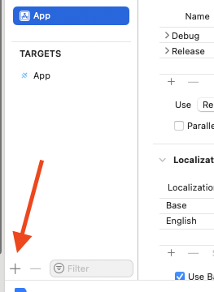
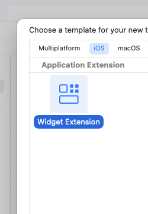
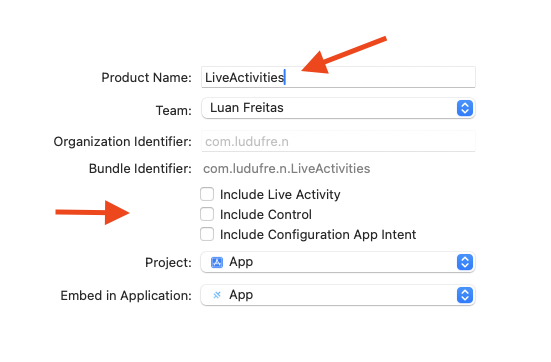
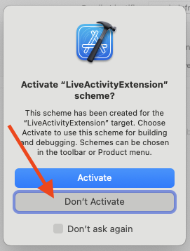
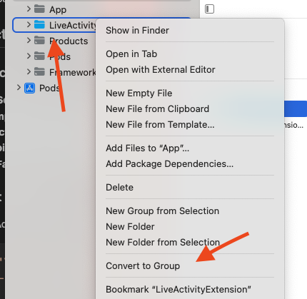
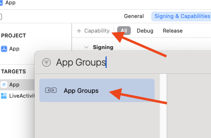
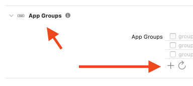
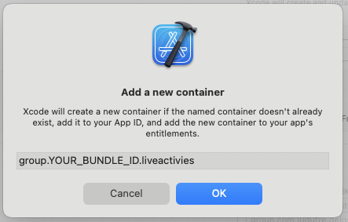

<p align="center"><br></p>
<h3 align="center">Live Activities</h3>
<p align="center"><strong><code>capacitor-live-activities</code></strong></p>
<p align="center">
  Ionic Capacitor plugin for <a href="https://developer.apple.com/videos/play/wwdc2023/10184/">Live Activities</a> for iOS 16.2+
</p>

> **⚠️ Development Status**: This plugin is currently under active development. Documentation and examples are still being added and may be incomplete. Please check back for updates.

<p align="center">
  
  <a href="https://www.npmjs.com/package/capacitor-live-activities"></a>
  <a href="https://www.npmjs.com/package/capacitor-live-activities"></a>
  <a href="https://www.npmjs.com/package/capacitor-live-activities"></a>
<!-- ALL-CONTRIBUTORS-BADGE:START - Do not remove or modify this section -->
<a href="#contributors-"></a>
<!-- ALL-CONTRIBUTORS-BADGE:END -->
<br />
<a href="https://www.buymeacoffee.com/ludufre"></a>
</p>

## Maintainers

| Maintainer             | GitHub                                | Social                            | LinkedIn                                                           |
| ---------------------- | ------------------------------------- | --------------------------------- | ------------------------------------------------------------------ |
| Luan Freitas (ludufre) | [ludufre](https://github.com/ludufre) | [@ludufre](https://x.com/ludufre) | [Luan Freitas](https://www.linkedin.com/in/luan-freitas-14341687/) |

## Installation

```bash
npm install capacitor-live-activities
npx cap sync

# or using pnpm
pnpm install capacitor-live-activities
npx cap sync
```

### Add target Widget Extension

- `Product Name` must be `LiveActivities`
- Uncheck `Include Live Activity`, `Include Control` and `Include Configuration App Intenet`
- Convert LiveActivities to Folder

  
  
  
  
  

Add to `ios/App/Podfile` after add WidgetKit Extension

```ruby
target 'LiveActivitiesExtension' do
  pod 'LiveActivitiesKit', :path => '../../node_modules/capacitor-live-activities'
end
```

Add to `ios/App/Info.plist`

```xml
<key>NSSupportsLiveActivities</key>
<true/>
```

Add `import LiveActivitiesKit` and `DynamicLiveActivity()` to `ios/App/LiveActivities/LiveActivitiesBundle.swift`


```swift
import WidgetKit
import SwiftUI
import LiveActivitiesKit

@main
struct LiveActivitiesBundle: WidgetBundle {
    var body: some Widget {
        LiveActivities()
        DynamicActivityWidget()
    }
}
``` 

### Add `App Groups` capability to your iOS project in Xcode.

- The name must be `group.YOUR_BUNDLE_ID.liveactivities`, like `group.com.example.myapp.liveactivities`
- Add the new App Group to your WidgetKit Extension target as well.

  
  
  

<br />
<a href="https://www.buymeacoffee.com/ludufre"></a>

## API

<docgen-index>

* [`startActivity(...)`](#startactivity)
* [`updateActivity(...)`](#updateactivity)
* [`endActivity(...)`](#endactivity)
* [`getAllActivities()`](#getallactivities)
* [`debugActivities()`](#debugactivities)
* [`saveImage(...)`](#saveimage)
* [`removeImage(...)`](#removeimage)
* [`listImages()`](#listimages)
* [`cleanupImages()`](#cleanupimages)
* [Interfaces](#interfaces)
* [Type Aliases](#type-aliases)

</docgen-index>

<docgen-api>
<!--Update the source file JSDoc comments and rerun docgen to update the docs below-->

Main interface for Live Activity plugin functionality

### startActivity(...)

```typescript
startActivity(options: LiveActivitiesOptions) => any
```

Start a new Live Activity

| Param         | Type                                                                    | Description                                 |
| ------------- | ----------------------------------------------------------------------- | ------------------------------------------- |
| **`options`** | <code><a href="#liveactivitiesoptions">LiveActivitiesOptions</a></code> | Configuration options for the Live Activity |

**Returns:** <code>any</code>

--------------------


### updateActivity(...)

```typescript
updateActivity(options: UpdateActivityOptions) => any
```

Update an existing Live Activity

| Param         | Type                                                                    | Description                                       |
| ------------- | ----------------------------------------------------------------------- | ------------------------------------------------- |
| **`options`** | <code><a href="#updateactivityoptions">UpdateActivityOptions</a></code> | Update options including activity ID and new data |

**Returns:** <code>any</code>

--------------------


### endActivity(...)

```typescript
endActivity(options: EndActivityOptions) => any
```

End a Live Activity

| Param         | Type                                                              | Description                                  |
| ------------- | ----------------------------------------------------------------- | -------------------------------------------- |
| **`options`** | <code><a href="#endactivityoptions">EndActivityOptions</a></code> | Options including activity ID and final data |

**Returns:** <code>any</code>

--------------------


### getAllActivities()

```typescript
getAllActivities() => any
```

Get all active Live Activities

**Returns:** <code>any</code>

--------------------


### debugActivities()

```typescript
debugActivities() => any
```

Get debug information about Live Activities

**Returns:** <code>any</code>

--------------------


### saveImage(...)

```typescript
saveImage(options: { imageData: string; name: string; compressionQuality?: number; }) => any
```

Save an image for use in Live Activities

| Param         | Type                                                                           | Description        |
| ------------- | ------------------------------------------------------------------------------ | ------------------ |
| **`options`** | <code>{ imageData: string; name: string; compressionQuality?: number; }</code> | Image save options |

**Returns:** <code>any</code>

--------------------


### removeImage(...)

```typescript
removeImage(options: { name: string; }) => any
```

Remove a saved image

| Param         | Type                           | Description                       |
| ------------- | ------------------------------ | --------------------------------- |
| **`options`** | <code>{ name: string; }</code> | Options with image name to remove |

**Returns:** <code>any</code>

--------------------


### listImages()

```typescript
listImages() => any
```

List all saved images

**Returns:** <code>any</code>

--------------------


### cleanupImages()

```typescript
cleanupImages() => any
```

Clean up all saved images

**Returns:** <code>any</code>

--------------------


### Interfaces


#### DynamicIslandLayout

Dynamic Island layout configuration for different states

| Prop                  | Type                                                                                                                                                                                                                                    | Description                               |
| --------------------- | --------------------------------------------------------------------------------------------------------------------------------------------------------------------------------------------------------------------------------------- | ----------------------------------------- |
| **`expanded`**        | <code>{ leading?: <a href="#layoutelement">LayoutElement</a>; trailing?: <a href="#layoutelement">LayoutElement</a>; center?: <a href="#layoutelement">LayoutElement</a>; bottom?: <a href="#layoutelement">LayoutElement</a>; }</code> | Expanded state layout with multiple areas |
| **`compactLeading`**  | <code>{ element: <a href="#layoutelement">LayoutElement</a>; }</code>                                                                                                                                                                   | Compact leading state configuration       |
| **`compactTrailing`** | <code>{ element: <a href="#layoutelement">LayoutElement</a>; }</code>                                                                                                                                                                   | Compact trailing state configuration      |
| **`minimal`**         | <code>{ element: <a href="#layoutelement">LayoutElement</a>; }</code>                                                                                                                                                                   | Minimal state configuration               |


#### UpdateActivityOptions

Options for updating an existing Live Activity

| Prop                     | Type                                                          | Description                                   |
| ------------------------ | ------------------------------------------------------------- | --------------------------------------------- |
| **`activityId`**         | <code>string</code>                                           | ID of the activity to update                  |
| **`data`**               | <code>Record&lt;string, any&gt;</code>                        | New data for the activity                     |
| **`alertConfiguration`** | <code>{ title: string; body: string; sound?: string; }</code> | Alert configuration for the update (optional) |


#### EndActivityOptions

Options for ending a Live Activity

| Prop             | Type                                   | Description                 |
| ---------------- | -------------------------------------- | --------------------------- |
| **`activityId`** | <code>string</code>                    | ID of the activity to end   |
| **`data`**       | <code>Record&lt;string, any&gt;</code> | Final data for the activity |


#### ActivityInfo

Information about an active Live Activity

| Prop                 | Type                                                      | Description                                     |
| -------------------- | --------------------------------------------------------- | ----------------------------------------------- |
| **`id`**             | <code>string</code>                                       | Unique identifier of the activity               |
| **`layout`**         | <code><a href="#activitylayout">ActivityLayout</a></code> | Layout configuration of the activity            |
| **`data`**           | <code>Record&lt;string, any&gt;</code>                    | Current data of the activity                    |
| **`staleDate`**      | <code>number</code>                                       | Date when the activity becomes stale (optional) |
| **`relevanceScore`** | <code>number</code>                                       | Relevance score of the activity (optional)      |


#### DebugActivities

Debug information about Live Activities

| Prop             | Type                | Description               |
| ---------------- | ------------------- | ------------------------- |
| **`activities`** | <code>{}</code>     | Array of all activities   |
| **`count`**      | <code>number</code> | Total count of activities |


### Type Aliases


#### LiveActivitiesOptions

Configuration options for starting a Live Activity

<code>{ /** Layout configuration for the activity */ layout: <a href="#activitylayout">ActivityLayout</a>; /** Dynamic Island layout configuration (optional) */ dynamicIslandLayout?: <a href="#dynamicislandlayout">DynamicIslandLayout</a>; /** Dynamic data to be displayed in the activity */ data: Record&lt;string, any&gt;; /** Date when the activity becomes stale (optional) */ staleDate?: number; /** Relevance score for activity prioritization (optional) */ relevanceScore?: number; /** Behavior configuration for the activity */ behavior: <a href="#liveactivitiesbehavior">LiveActivitiesBehavior</a>; }</code>


#### ActivityLayout

Layout configuration for an activity

<code><a href="#layoutelement">LayoutElement</a></code>


#### LayoutElement

Union type representing any layout element with a unique ID

<code><a href="#prettify">Prettify</a>&lt; { /** Unique identifier for the element */ id: string; } & (<a href="#layoutelementcontainer">LayoutElementContainer</a> | <a href="#layoutelementtext">LayoutElementText</a> | <a href="#layoutelementimage">LayoutElementImage</a> | <a href="#layoutelementprogress">LayoutElementProgress</a> | <a href="#layoutelementtimer">LayoutElementTimer</a>) &gt;</code>


#### Prettify

Utility type to make complex types more readable in IntelliSense

<code>{ [K in keyof T]: <a href="#prettify">Prettify</a>&lt;T[K]&gt;; } & {}</code>


#### LayoutElementContainer

Container element that can hold other layout elements

<code><a href="#prettify">Prettify</a>&lt;{ /** Element type identifier */ type: 'container'; /** Container properties as array of property objects */ properties?: <a href="#containerpropertyobject">ContainerPropertyObject</a>; /** Child elements contained within this container */ children: LayoutElement[]; }&gt;</code>


#### ContainerPropertyObject

Container-specific property objects

<code>(<a href="#basepropertyobject">BasePropertyObject</a> | <a href="#containerpropertyobjectbase">ContainerPropertyObjectBase</a> | <a href="#containerpropertyobjectvertical">ContainerPropertyObjectVertical</a>)[] | (<a href="#basepropertyobject">BasePropertyObject</a> | <a href="#containerpropertyobjectbase">ContainerPropertyObjectBase</a> | <a href="#containerpropertyobjecthorizontal">ContainerPropertyObjectHorizontal</a>)[] | (<a href="#basepropertyobject">BasePropertyObject</a> | <a href="#containerpropertyobjectbase">ContainerPropertyObjectBase</a> | <a href="#containerpropertyobjectstack">ContainerPropertyObjectStack</a>)[]</code>


#### BasePropertyObject

Base properties that all layout elements can have as individual objects

<code>{ offset: { x?: number; y?: number } } | { zIndex: number } | { opacity: number } | { rotation: number } | { scale: number } | { width: number } | { height: number } | { maxWidth: number } | { maxHeight: number } | { minWidth: number } | { minHeight: number } | { backgroundGradient: { colors: ColorString[]; startPoint: <a href="#gradientpoint">GradientPoint</a>; endPoint: <a href="#gradientpoint">GradientPoint</a> } } | { backgroundCapsule: { foregroundColor: <a href="#colorstring">ColorString</a> } } | { paddingVertical: number } | { paddingHorizontal: number } | { multilineTextAlignment: 'leading' | 'center' | 'trailing' | 'left' | 'right' } | { shadow: { color?: <a href="#colorstring">ColorString</a>; radius?: number; x?: number; y?: number } }</code>


#### ColorString

<code>'primary' | 'secondary' | 'accent' | 'red' | 'blue' | 'green' | 'yellow' | 'orange' | 'purple' | 'pink' | 'black' | 'white' | 'gray' | 'clear' | `#${string}`</code>


#### GradientPoint

Background Gradient point options for defining gradient direction

<code>'top' | 'bottom' | 'leading' | 'trailing' | 'topLeading' | 'topTrailing' | 'bottomLeading' | 'bottomTrailing' | 'center'</code>


#### ContainerPropertyObjectBase

<code>{ spacing: number } | { padding: number | boolean } | { foregroundColor: <a href="#colorstring">ColorString</a> } | { backgroundColor: <a href="#colorstring">ColorString</a> } | { cornerRadius: number } | { borderWidth: number } | { borderColor: <a href="#colorstring">ColorString</a> } | { alignment: <a href="#containerpropertyobjectstackalignment">ContainerPropertyObjectStackAlignment</a> }</code>


#### ContainerPropertyObjectStackAlignment

<code>'top' | 'top-leading' | 'top-trailing' | 'top-left' | 'top-right' | 'bottom' | 'bottom-left' | 'bottom-right' | 'center' | 'center-first-text-baseline' | 'center-last-text-baseline' | 'leading' | 'leading-first-text-baseline' | 'leading-last-text-baseline' | 'left' | 'left-first-text-baseline' | 'left-last-text-baseline' | 'trailing' | 'trailing-first-text-baseline' | 'trailing-last-text-baseline' | 'right' | 'right-first-text-baseline' | 'right-last-text-baseline'</code>


#### ContainerPropertyObjectVertical

<code>{ direction: 'vertical' } | { insideAlignment: | 'center' | 'leading' | 'left' | 'list-row-separator-leading' | 'list-row-separator-trailing' | 'list-row-separator-left' | 'list-row-separator-right' | 'trailing' | 'right'; }</code>


#### ContainerPropertyObjectHorizontal

<code>{ direction: 'horizontal' } | { insideAlignment: 'bottom' | 'center' | 'first-text-baseline' | 'last-text-baseline' | 'top' }</code>


#### ContainerPropertyObjectStack

<code>{ direction: 'stack' } | { insideAlignment: <a href="#containerpropertyobjectstackalignment">ContainerPropertyObjectStackAlignment</a>; }</code>


#### LayoutElementText

Text element for displaying text content

<code><a href="#prettify">Prettify</a>&lt;{ /** Element type identifier */ type: 'text'; /** Text properties as array of property objects */ properties: TextPropertyObject[]; }&gt;</code>


#### TextPropertyObject

Text-specific property objects

<code><a href="#basepropertyobject">BasePropertyObject</a> | { text: string } | { fontSize: number } | { fontWeight: 'regular' | 'medium' | 'semibold' | 'bold' | 'heavy' | 'light' | 'thin' | 'black' } | { fontFamily: string } | { color: <a href="#colorstring">ColorString</a> } | { alignment: 'leading' | 'center' | 'trailing' | 'left' | 'right' } | { lineLimit: number } | { italic: boolean } | { underline: boolean } | { strikethrough: boolean } | { monospacedDigit: boolean }</code>


#### LayoutElementImage

Image element for displaying images from various sources

<code><a href="#prettify">Prettify</a>&lt;{ /** Element type identifier */ type: 'image'; /** Image properties as array of property objects */ properties: ImagePropertyObject[]; }&gt;</code>


#### ImagePropertyObject

Image-specific property objects

<code><a href="#basepropertyobject">BasePropertyObject</a> | { contentMode: 'fit' | 'fill' } | { cornerRadius: number } | { systeName: string } | { color: <a href="#colorstring">ColorString</a> } | { url: string } | { appGroup: string } | { asset: string } | { base64: string } | { resizable: boolean }</code>


#### LayoutElementProgress

Progress bar element for showing completion progress

<code><a href="#prettify">Prettify</a>&lt;{ /** Element type identifier */ type: 'progress'; /** Progress bar properties as array of property objects */ properties: ProgressPropertyObject[]; }&gt;</code>


#### ProgressPropertyObject

Progress-specific property objects

<code><a href="#basepropertyobject">BasePropertyObject</a> | { value: number } | { total: number } | { color: <a href="#colorstring">ColorString</a> } | { backgroundColor: <a href="#colorstring">ColorString</a> } | { height: number }</code>


#### LayoutElementTimer

Timer element for displaying countdown or time information

<code><a href="#prettify">Prettify</a>&lt;{ /** Element type identifier */ type: 'timer'; /** Timer properties as array of property objects */ properties: TimerPropertyObject[]; }&gt;</code>


#### TimerPropertyObject

Timer-specific property objects

<code><a href="#textpropertyobject">TextPropertyObject</a> | { endTime: number } | { style: 'timer' | 'relative' | 'date' | 'time' | 'offset' | 'countdown' }</code>


#### LiveActivitiesBehavior

Behavior configuration for a Live Activity

<code>{ backgroundTint?: <a href="#colorstring">ColorString</a>; systemActionForegroundColor: <a href="#colorstring">ColorString</a>; widgetUrl: string; keyLineTint: <a href="#colorstring">ColorString</a>; }</code>

</docgen-api>
